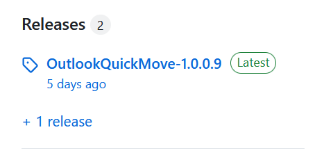
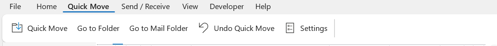
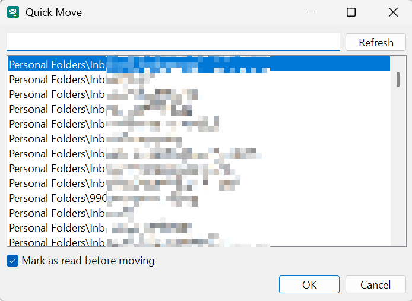
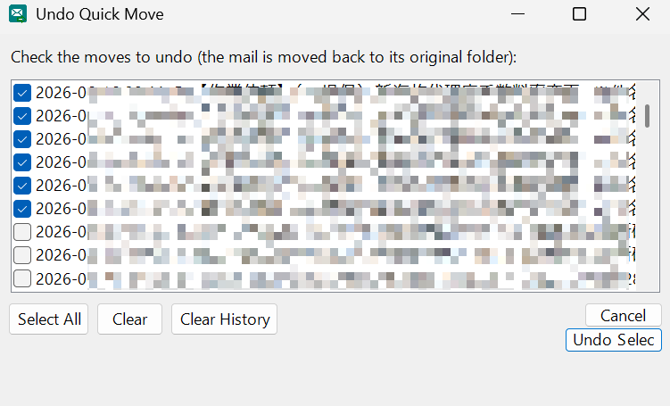
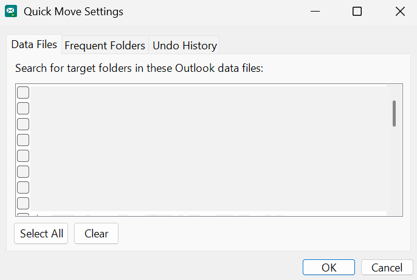
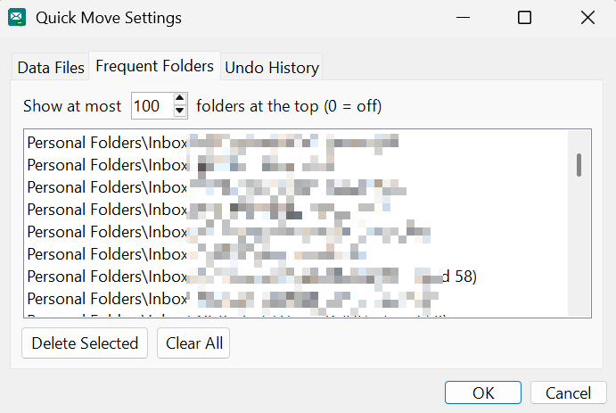
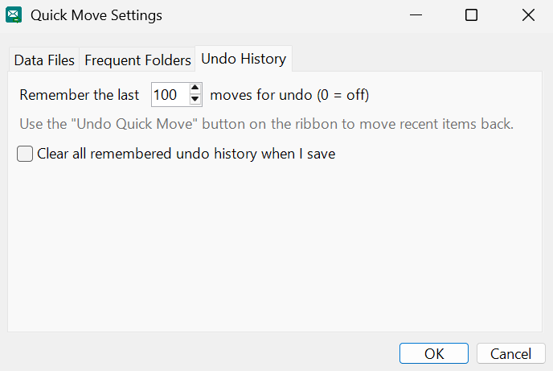
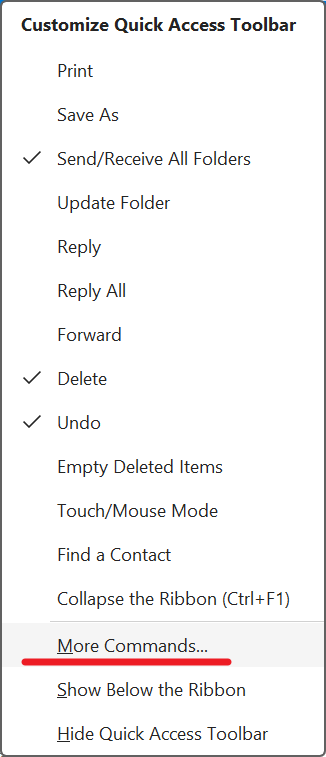
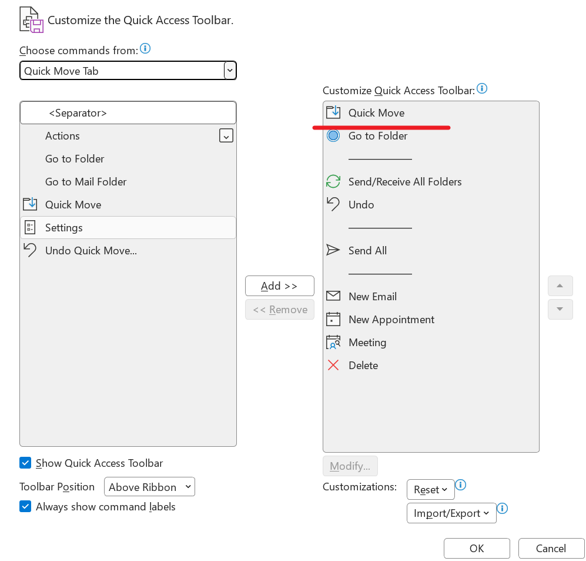

# OutlookQuickMove Installation and User Guide

English | [中文](USER_GUIDE.zh-CN.md)

OutlookQuickMove is a VSTO add-in for classic Outlook for Windows. It helps you move selected mail items to a searched folder, jump to a folder by keyword, or jump to the folder that contains a selected mail item.

## Requirements

- Classic Outlook for Windows.
- New Outlook, Outlook on the web, and Outlook for Mac are not supported.
- Close Outlook before installing the add-in.

## Install

1. Open the GitHub Releases page and download the latest release archive, for example `OutlookQuickMove-1.0.0.9.7z`.
2. Extract the archive to a stable local folder. Do not run the installer from inside the archive.
3. Make sure Outlook is closed.
4. Double-click `setup.exe` from the extracted folder.
5. Follow the installation wizard.
6. Open Outlook after installation completes.

## Open Quick Move

After installation and restarting Outlook, a `Quick Move` tab appears in the Outlook ribbon.

The tab contains these buttons:

- `Quick Move`
- `Go to Folder`
- `Go to Mail Folder`
- `Undo Quick Move...`
- `Settings`

## Quick Move

`Quick Move` moves the currently selected mail items to a target folder.

1. Select one or more mail items in Outlook.
2. Click `Quick Move`.
3. The dialog opens with focus in the search box.
4. Type keywords from the target folder name or path. The folder list filters as you type.
5. Use the arrow keys to choose a folder, or keep the highlighted result.
6. Press `Enter`, or click the confirmation button, to move the selected mail items.

If your Outlook profile has many data files, the first `Quick Move` after restarting Outlook can take longer. The add-in needs to build the folder list. Later openings usually reuse the cache and are faster.

Select `Mark as read before moving` if the selected mail should be marked as read before it is moved.

## Go to Folder

`Go to Folder` jumps to a folder without moving any mail.

1. Click `Go to Folder`.
2. Type folder keywords.
3. Select the target folder.
4. Press `Enter`. Outlook switches to that folder.

It uses the same folder scope as `Quick Move` and reuses the frequent-folder ordering.

## Go to Mail Folder

`Go to Mail Folder` jumps to the folder that contains the currently selected mail item.

This is useful from Outlook search results. After finding a message, select it and click `Go to Mail Folder` to return to the original folder that contains it.

If multiple items are selected, the add-in asks for confirmation and uses the first selected mail item as the target.

## Undo Quick Move

`Undo Quick Move...` reverses moves made by `Quick Move`.

1. Click `Undo Quick Move...`.
2. Choose the move records you want to undo.
3. Click `Undo Selected`.
4. The add-in tries to move the mail items back to their original folders and restore their previous read or unread state.

## Settings

`Settings` controls the searched data files, frequent-folder count, and undo-history count.

### Data Files

Use `Data Files` to choose which Outlook data files are searched for target folders.

If you only want to search one mailbox or PST file, select only that data file. This keeps the candidate list smaller and can reduce the cost of building the folder list the first time.

### Frequent Folders

`Frequent Folders` controls how many frequently used target folders appear at the top of the candidate list.

Frequent folders are ordered automatically based on actual `Quick Move` usage. Set the value to `0` to turn off the frequent-folder display.

### Undo History

`Undo History` controls how many recent move records are kept for undo.

Set the value to `0` to stop recording new undo history. Existing history remains until it is cleared manually.

## Keyboard Shortcut

OutlookQuickMove does not register a global shortcut. The recommended shortcut path is Outlook's built-in Quick Access Toolbar, which lets you open a command with `Alt + number`.

1. Open the Quick Access Toolbar drop-down menu.
2. Click `More Commands...`.
3. In `Choose commands from`, select `Quick Move Tab`.
4. Select `Quick Move`, then click `Add >>`.
5. Click `OK` to save.
6. Use `Alt + number`, based on the button's position in the Quick Access Toolbar.

For example, if `Quick Move` is the first button in the Quick Access Toolbar, press `Alt + 1` to open it.

## Screenshot Privacy Check

Before syncing these screenshots to the public repository, confirm that they do not include:

- Real names, email addresses, work accounts, or profile photos.
- Mail subjects, sender names, recipient names, or message previews.
- Private mailbox, PST, OST, or shared mailbox names.
- Private folder names, customer names, project names, or ticket numbers.
- Windows usernames, local paths, or network paths.
- Any detail that can identify a person, workplace, customer, or private workflow.

Use test mailboxes and test folders where possible. If a real Outlook profile must be shown, blur or crop every sensitive area before committing the screenshot.
